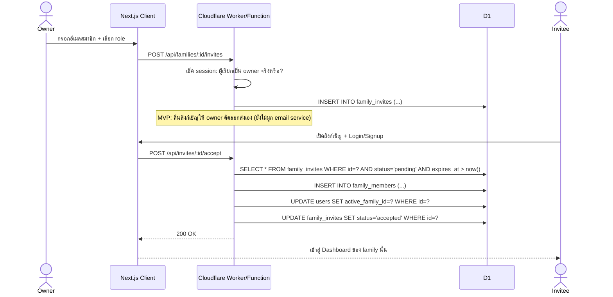
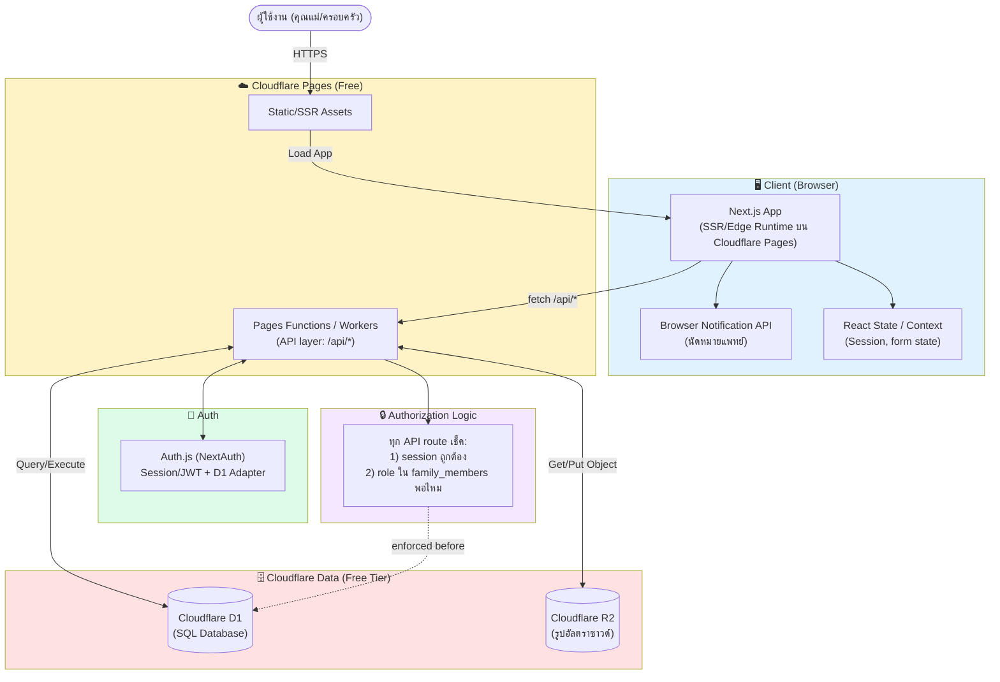

# Pregnancy Tracker — ER Diagram & System Architecture

> เอกสารนี้ใช้เป็น spec อ้างอิงสำหรับพัฒนาโค้ด (เช่น ใช้ประกอบ prompt ให้ Codex)
> อัปเดตล่าสุด: DB เปลี่ยนจาก Firebase Firestore → **Cloudflare D1 (SQL)**
> Phase 1 = MVP, Phase 2 = เนื้อหารายสัปดาห์, Phase 3 = หลังคลอด

---

## 0. สรุปการเปลี่ยน Stack (สำคัญ)

| ส่วน | เดิม (Firebase) | ใหม่ (Cloudflare) |
|---|---|---|
| Database | Firestore (NoSQL) | **Cloudflare D1** (SQLite-based SQL, free tier) |
| Hosting | Firebase Hosting | **Cloudflare Pages** |
| Backend/API | ไม่มี (client เรียก SDK ตรง) | **Cloudflare Pages Functions / Workers** (จำเป็น เพราะ D1 เข้าถึงจาก browser ตรงไม่ได้) |
| Auth | Firebase Authentication | **Auth.js (NextAuth) + D1 Adapter** หรือ Lucia Auth (ฟรี, self-managed) |
| File Storage (รูปอัลตราซาวด์) | Firebase Storage | **Cloudflare R2** (free tier 10GB) |
| Push/Reminder | Browser Notification API | Browser Notification API (เหมือนเดิม) |

**เหตุผลที่ต้องมี API layer เพิ่ม:** D1 ไม่มี client-side SDK ที่ปลอดภัยแบบ Firestore (ที่ enforce security ผ่าน rules ได้ที่ตัว DB เอง) ดังนั้นทุก query ต้องผ่าน Worker/Function ที่รันฝั่ง server แล้วเช็คสิทธิ์เอง ก่อน query SQL

---

## 1. ER Diagram (SQL Schema)

```mermaid
erDiagram
    users ||--o{ family_members : "is a"
    families ||--o{ family_members : "has"
    families ||--o{ family_invites : "sends"
    families ||--o| pregnancy_profiles : "has"
    families ||--o{ weekly_logs : "records"
    families ||--o{ appointments : "schedules"
    families ||--o| baby_profiles : "has (Phase 3)"
    baby_profiles ||--o{ baby_logs : "records (Phase 3)"
    users ||--o{ weekly_logs : "recorded_by"
    users ||--o{ appointments : "created_by"

    users {
        text id PK "UUID"
        text name
        text email UK
        text password_hash "nullable ถ้าใช้ OAuth"
        text active_family_id FK "nullable"
        datetime created_at
    }

    families {
        text id PK "UUID"
        text name
        text owner_id FK "users.id"
        datetime created_at
    }

    family_members {
        text id PK "UUID"
        text family_id FK
        text user_id FK
        text role "owner | editor | viewer"
        text status "active | invited | removed"
        datetime joined_at
    }

    family_invites {
        text id PK "UUID"
        text family_id FK
        text invited_email
        text invited_role "editor | viewer"
        text invited_by FK "users.id"
        text status "pending | accepted | declined | expired"
        datetime created_at
        datetime expires_at
    }

    pregnancy_profiles {
        text family_id PK_FK
        date lmp_date "Last Menstrual Period"
        date due_date "คำนวณจาก lmp_date"
        text status "pregnant | postpartum"
        datetime updated_at
    }

    weekly_logs {
        text id PK "UUID"
        text family_id FK
        text recorded_by FK "users.id"
        int week
        real weight "กก., nullable"
        int bp_systolic "nullable"
        int bp_diastolic "nullable"
        text symptoms "JSON array string"
        text mood "great|good|okay|tired|bad, nullable"
        text note
        date log_date
    }

    appointments {
        text id PK "UUID"
        text family_id FK
        text created_by FK "users.id"
        datetime appt_datetime
        text doctor_name
        text note
        int reminder_enabled "0|1"
        int reminder_minutes_before
    }

    baby_profiles {
        text family_id PK_FK
        text name
        date birth_date
    }

    baby_logs {
        text id PK "UUID"
        text family_id FK
        int age_in_weeks
        text feeding "Phase 3"
        text sleep "Phase 3"
        text vaccination "Phase 3"
        real growth "Phase 3"
    }
```

### ตัวอย่าง DDL (SQLite / D1 syntax) — สำหรับ Codex อ้างอิงตรงๆ

```sql
CREATE TABLE users (
  id TEXT PRIMARY KEY,
  name TEXT NOT NULL,
  email TEXT UNIQUE NOT NULL,
  password_hash TEXT,
  active_family_id TEXT REFERENCES families(id),
  created_at TEXT DEFAULT (datetime('now'))
);

CREATE TABLE families (
  id TEXT PRIMARY KEY,
  name TEXT NOT NULL,
  owner_id TEXT NOT NULL REFERENCES users(id),
  created_at TEXT DEFAULT (datetime('now'))
);

CREATE TABLE family_members (
  id TEXT PRIMARY KEY,
  family_id TEXT NOT NULL REFERENCES families(id),
  user_id TEXT NOT NULL REFERENCES users(id),
  role TEXT NOT NULL CHECK (role IN ('owner','editor','viewer')),
  status TEXT NOT NULL DEFAULT 'active' CHECK (status IN ('active','invited','removed')),
  joined_at TEXT DEFAULT (datetime('now')),
  UNIQUE(family_id, user_id)
);

CREATE TABLE family_invites (
  id TEXT PRIMARY KEY,
  family_id TEXT NOT NULL REFERENCES families(id),
  invited_email TEXT NOT NULL,
  invited_role TEXT NOT NULL CHECK (invited_role IN ('editor','viewer')),
  invited_by TEXT NOT NULL REFERENCES users(id),
  status TEXT NOT NULL DEFAULT 'pending' CHECK (status IN ('pending','accepted','declined','expired')),
  created_at TEXT DEFAULT (datetime('now')),
  expires_at TEXT NOT NULL
);

CREATE TABLE pregnancy_profiles (
  family_id TEXT PRIMARY KEY REFERENCES families(id),
  lmp_date TEXT,
  due_date TEXT,
  status TEXT NOT NULL DEFAULT 'pregnant' CHECK (status IN ('pregnant','postpartum')),
  updated_at TEXT DEFAULT (datetime('now'))
);

CREATE TABLE weekly_logs (
  id TEXT PRIMARY KEY,
  family_id TEXT NOT NULL REFERENCES families(id),
  recorded_by TEXT NOT NULL REFERENCES users(id),
  week INTEGER NOT NULL,
  weight REAL,
  bp_systolic INTEGER,
  bp_diastolic INTEGER,
  symptoms TEXT, -- JSON array เก็บเป็น string เช่น '["คลื่นไส้","ปวดหลัง"]'
  mood TEXT CHECK (mood IN ('great','good','okay','tired','bad')),
  note TEXT,
  log_date TEXT NOT NULL
);
CREATE INDEX idx_weekly_logs_family ON weekly_logs(family_id, log_date);

CREATE TABLE appointments (
  id TEXT PRIMARY KEY,
  family_id TEXT NOT NULL REFERENCES families(id),
  created_by TEXT NOT NULL REFERENCES users(id),
  appt_datetime TEXT NOT NULL,
  doctor_name TEXT,
  note TEXT,
  reminder_enabled INTEGER NOT NULL DEFAULT 1,
  reminder_minutes_before INTEGER NOT NULL DEFAULT 60
);
CREATE INDEX idx_appointments_family ON appointments(family_id, appt_datetime);

-- Phase 3
CREATE TABLE baby_profiles (
  family_id TEXT PRIMARY KEY REFERENCES families(id),
  name TEXT,
  birth_date TEXT
);

CREATE TABLE baby_logs (
  id TEXT PRIMARY KEY,
  family_id TEXT NOT NULL REFERENCES families(id),
  age_in_weeks INTEGER,
  feeding TEXT,
  sleep TEXT,
  vaccination TEXT,
  growth REAL
);
```

### Role & Permission Matrix

| Action | owner | editor | viewer |
|---|:---:|:---:|:---:|
| ดูข้อมูลการตั้งครรภ์/สุขภาพ/นัดหมาย | ✅ | ✅ | ✅ |
| เพิ่ม/แก้ไข weekly_logs, appointments | ✅ | ✅ | ❌ |
| ลบ weekly_logs, appointments | ✅ | ✅ | ❌ |
| แก้ไข pregnancy_profiles (LMP/dueDate) | ✅ | ❌ | ❌ |
| เชิญสมาชิกใหม่ | ✅ | ❌ | ❌ |
| ลบสมาชิก / เปลี่ยน role | ✅ | ❌ | ❌ |
| ลบ family ทั้งหมด | ✅ | ❌ | ❌ |

**หมายเหตุการออกแบบ:**
- ทุก query ต้องผ่าน API layer (Worker/Pages Function) ที่ทำ 2 ขั้นตอนก่อนแตะ D1 เสมอ: (1) verify session/JWT ว่าเป็นใคร (2) `SELECT role FROM family_members WHERE family_id=? AND user_id=?` เพื่อเช็คสิทธิ์ตาม matrix ด้านบน — เพราะ D1 **ไม่มี** row-level security แบบ Firestore rules
- `symptoms` เก็บเป็น JSON string ใน column เดียว (SQLite ไม่มี array type จริง) — parse/stringify ฝั่ง API
- Index บน `(family_id, log_date)` และ `(family_id, appt_datetime)` ไว้รองรับการ query ตามช่วงเวลาบ่อยๆ
- **1 user อยู่ได้หลาย family** ผ่าน `family_members` แต่ MVP บังคับ 1 user = 1 active family (`users.active_family_id`) ก่อน เพื่อความง่าย

### Sequence: Invite Flow (อัปเดตสำหรับ Cloudflare)



---

## 2. System Architecture



### คำอธิบาย Flow

1. **ผู้ใช้เปิดเว็บ** → Cloudflare Pages เสิร์ฟ Next.js app (รันบน Cloudflare's edge runtime)
2. **Login/Signup** → Client เรียก Auth.js API routes → สร้าง session (JWT หรือ session table ใน D1)
3. **อ่าน/เขียนข้อมูล** → Client `fetch()` ไปยัง `/api/*` (Pages Function) **เท่านั้น** — ห้ามต่อ D1 ตรงจาก browser เด็ดขาด ทุก endpoint ต้องเช็ค session + role ก่อน query เสมอ
4. **อัปโหลดรูป** → Client → API route → เขียนเข้า R2 ผ่าน binding (ไม่ expose R2 credentials ให้ client)
5. **แจ้งเตือนนัดหมาย** → Browser Notification API ฝั่ง client (เหมือนเดิม)

### สถาปัตยกรรมแบบ Edge + API (เปลี่ยนจาก Client-only)

จุดต่างสำคัญจากแผนเดิม (Firebase): ตอนนี้ **ต้องมี API layer** เพราะ:
- ✅ ยังฟรีได้ 100% — Cloudflare Pages/Workers free tier (100,000 requests/วัน), D1 free tier (5GB storage, 5M row reads/วัน), R2 free tier (10GB storage)
- ✅ Logic การเช็คสิทธิ์ (role-based) ทำที่เดียวในโค้ด server ปลอดภัยกว่าพึ่ง client-side rules
- ⚠️ ต้องเขียน API endpoints เอง (CRUD ทุก resource) — งานเพิ่มขึ้นจากแผนเดิมที่ไม่ต้องมี backend เลย
- ⚠️ Auth ต้อง self-manage (Auth.js) แทนที่จะได้ Firebase Auth สำเร็จรูป — ต้อง implement password hashing/session เอง (หรือใช้ OAuth provider เช่น Google ผ่าน Auth.js ลดงานส่วนนี้ได้)

### Layer Responsibility

| Layer | หน้าที่ | เทคโนโลยี |
|---|---|---|
| Presentation | UI, form, routing | Next.js + Tailwind CSS |
| API / Business Logic | CRUD, คำนวณอายุครรภ์, validation, authorization | Cloudflare Pages Functions (`/api/*`) |
| Data Access | Query/Execute SQL | D1 binding ใน Worker (`env.DB.prepare(...)`) |
| File Access | Upload/Download รูป | R2 binding ใน Worker |
| Security | ตรวจสอบ session + role ก่อนทุก request | Auth.js middleware + custom authz check ใน API route |
| Persistence | เก็บข้อมูลจริง | Cloudflare D1, R2 |
| Identity | ยืนยันตัวตน + session | Auth.js (NextAuth) |

---

## 3. หมายเหตุสำหรับการทดสอบ (Test Plan โดยย่อ)

| ประเภท | ขอบเขต | เครื่องมือแนะนำ |
|---|---|---|
| Unit Test | ฟังก์ชันคำนวณใน `lib/pregnancy.ts`, SQL query builders | Vitest |
| Integration Test | API routes + D1 ผ่าน `wrangler dev` (local D1 emulation, ฟรี) | Vitest + Wrangler local D1 |
| Authorization Test | ทดสอบว่า viewer เขียนข้อมูลไม่ได้, user นอก family เข้าไม่ได้ | Vitest ยิง API routes ตรง |
| E2E Test | Onboarding → Dashboard → บันทึกสุขภาพ → นัดหมาย → เชิญสมาชิก | Playwright |

**แนะนำ:** ใช้ `wrangler d1 execute --local` และ `wrangler pages dev` ระหว่าง dev/test เพื่อรันทั้ง D1 และ Functions ในเครื่องได้ฟรี ไม่กระทบข้อมูลจริง
