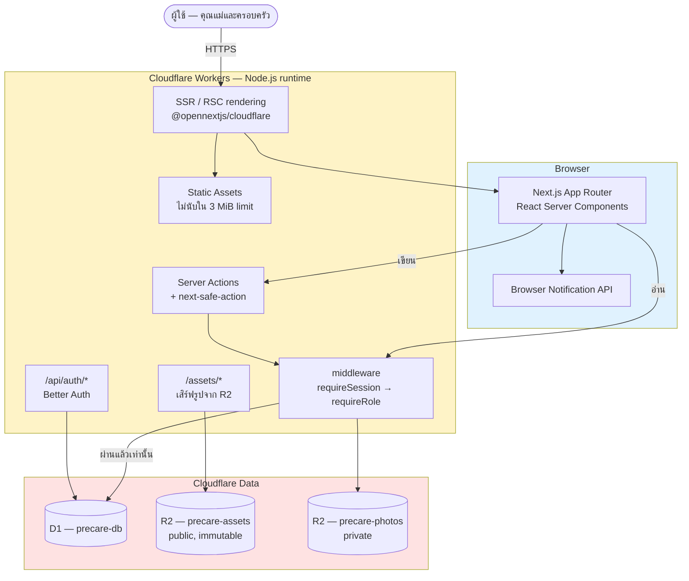
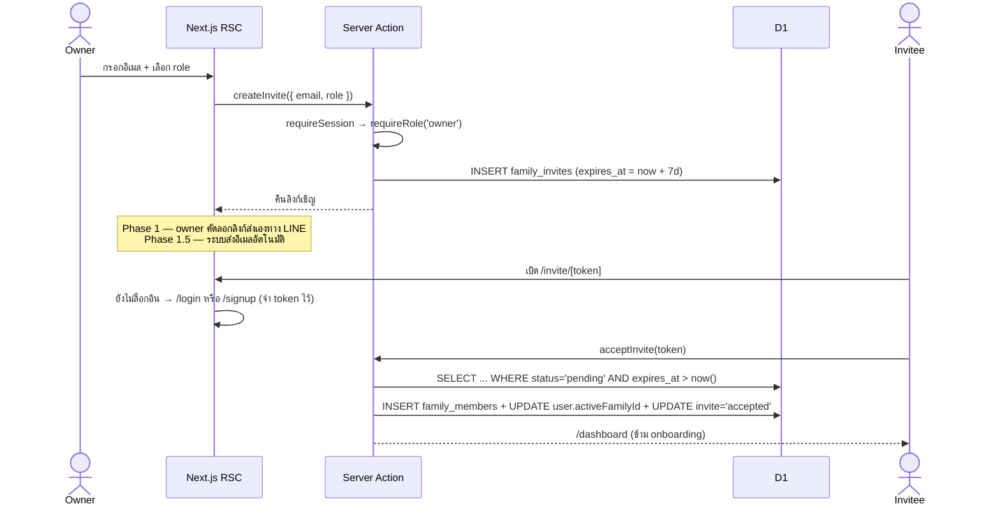

# Health Care — ER Diagram & System Architecture

> **ชื่อเรียก:** **Health Care** = ตัว web app · **Pre Care** = ฟีเจอร์บันทึกการตั้งครรภ์ (ฟีเจอร์แรกที่ทำ)
> เอกสารนี้เป็น spec อ้างอิงตอนเขียนโค้ด · อัปเดต 25 ส.ค. 2569 (T0.2)
> Phase 1 = MVP · Phase 1.5 = งานอีเมล · Phase 2 = อัลบั้ม + เนื้อหารายสัปดาห์ · Phase 3 = หลังคลอด

---

## 0. Stack ที่ใช้จริง

| ส่วน | เทคโนโลยี | หมายเหตุ |
|---|---|---|
| Framework | **Next.js 16** | App Router + React Server Components |
| Adapter | **`@opennextjs/cloudflare`** 1.20.x | ⚠️ ไม่ใช่ `@cloudflare/next-on-pages` ที่ถูก deprecate แล้ว |
| Hosting | **Cloudflare Workers** | ⚠️ ไม่ใช่ Pages · รันบน **Node.js runtime** ไม่ใช่ edge runtime |
| Database | **Cloudflare D1** (SQLite) | region APAC · `precare-db` (prod) / `precare-dev-db` (dev) |
| ORM | **Drizzle** + `drizzle-zod` | schema เดียวจ่ายทั้ง type และ validation |
| Auth | **Better Auth** | ⚠️ ไม่ใช่ Auth.js · Google OAuth + อีเมล/รหัสผ่าน |
| File Storage | **Cloudflare R2** | `precare-assets` (public) / `precare-photos` (private) |
| UI | Tailwind v4 + shadcn/ui | token อยู่ใน `src/app/globals.css` |
| Test | Vitest + `@cloudflare/vitest-pool-workers` | รันใน workerd จริง ต่อ binding D1 จริง |
| Push/Reminder | Browser Notification API | Phase 2 ค่อยขยับไป Web Push + Service Worker |

**ทำไมต้องมี server layer:** D1 ไม่มี client SDK ที่ปลอดภัยแบบ Firestore (ที่ enforce security rules ที่ตัว DB เอง) ทุก query จึงต้องผ่านโค้ดฝั่ง server ที่เช็คสิทธิ์เองก่อนแตะ D1

**Server layer หน้าตาเป็นยังไง**
- **อ่าน** → ดึงใน React Server Component ตรงๆ ไม่ต้องมี endpoint
- **เขียน** → **Server Actions** + `next-safe-action` ที่ทำ authz เป็น middleware chain
- **REST จริงเหลือแค่ 2 จุด** — `/api/auth/*` (Better Auth เป็นเจ้าของ) และ `/assets/*` (เสิร์ฟรูปจาก R2)

---

## 1. ER Diagram

```mermaid
erDiagram
    user ||--o{ session : "has"
    user ||--o{ account : "has"
    user ||--o{ family_members : "is a"
    families ||--o{ family_members : "has"
    families ||--o{ family_invites : "sends"
    families ||--o| pregnancy_profiles : "has"
    families ||--o{ weekly_logs : "records"
    families ||--o{ appointments : "schedules"
    families ||--o{ photos : "owns (Phase 2)"
    weekly_logs ||--o{ photos : "attached to"

    user {
        text id PK
        text email UK "= username ใช้ล็อกอิน"
        text image "avatar จาก Google หรือ R2"
        text active_family_id FK "additionalField ของเรา"
    }
    session {
        text id PK
        text userId FK
        datetime expiresAt "60 วัน rolling"
    }
    account {
        text id PK
        text userId FK
        text providerId "credential | google"
        text password "scrypt hash"
    }
    families {
        text id PK
        text name
        text owner_id FK
    }
    family_members {
        text id PK
        text family_id FK
        text user_id FK
        text role "owner | editor | viewer"
        text status "active | invited | removed"
    }
    family_invites {
        text id PK
        text family_id FK
        text invited_email
        text invited_role "editor | viewer"
        text status "pending | accepted | declined | expired"
        datetime expires_at
    }
    pregnancy_profiles {
        text family_id PK_FK
        date lmp_date
        date due_date
        text status "pregnant | postpartum"
    }
    weekly_logs {
        text id PK
        text family_id FK
        text recorded_by FK
        int week
        real weight
        int bp_systolic
        int bp_diastolic
        text symptoms "JSON array string"
        text mood
        date log_date
    }
    appointments {
        text id PK
        text family_id FK
        datetime appt_datetime
        text doctor_name
        text location "เพิ่มใน T1.1"
        int reminder_minutes_before
    }
    photos {
        text id PK
        text family_id FK
        text log_id FK "nullable"
        int week
        text type "ultrasound | family | other"
        text r2_key
        text thumb_key
    }
```

### 1.1 ตารางที่ Better Auth เป็นเจ้าของ — อย่าเขียน DDL เอง

`user`, `session`, `account`, `verification` ให้ **generate ด้วย Better Auth CLI** (`npx @better-auth/cli generate`) แล้วเอาผลลัพธ์ไปใส่ใน migration

**จุดที่พลาดง่าย:** ฟิลด์ของแอปเราอย่าง `active_family_id` **ห้ามสร้างตาราง `users` ของตัวเองแยกออกมา** ให้ประกาศเป็น `additionalFields` ใน config ของ Better Auth แล้วมันจะ generate คอลัมน์ลงตาราง `user` ให้เอง ไม่งั้นจะมีตารางผู้ใช้สองชุดที่ต้อง sync กันเอง

```ts
// src/lib/auth.ts
export const auth = betterAuth({
  database: drizzleAdapter(db, { provider: "sqlite" }),
  emailAndPassword: { enabled: true, requireEmailVerification: false }, // Phase 1.5 ค่อยเปิด
  socialProviders: {
    google: { clientId: env.GOOGLE_CLIENT_ID, clientSecret: env.GOOGLE_CLIENT_SECRET },
  },
  session: { expiresIn: 60 * 60 * 24 * 60, updateAge: 60 * 60 * 24 }, // 60 วัน rolling
  account: { accountLinking: { enabled: true } },   // อีเมลตรงกัน = บัญชีเดียวกัน
  user: { additionalFields: { activeFamilyId: { type: "string", required: false } } },
});
```

> `accountLinking` สำคัญกับ Phase 1 เป็นพิเศษ เพราะยังไม่มีปุ่มลืมรหัสผ่าน — คนที่ลืมรหัสจะกด "เข้าสู่ระบบด้วย Google" แล้วเข้าบัญชีเดิมได้ ถ้าอีเมลตรงกัน

### 1.2 DDL ของตารางฝั่งแอป (SQLite / D1)

```sql
CREATE TABLE families (
  id TEXT PRIMARY KEY,
  name TEXT NOT NULL,
  owner_id TEXT NOT NULL REFERENCES user(id),
  created_at TEXT NOT NULL DEFAULT (datetime('now'))
);

CREATE TABLE family_members (
  id TEXT PRIMARY KEY,
  family_id TEXT NOT NULL REFERENCES families(id) ON DELETE CASCADE,
  user_id TEXT NOT NULL REFERENCES user(id),
  role TEXT NOT NULL CHECK (role IN ('owner','editor','viewer')),
  status TEXT NOT NULL DEFAULT 'active' CHECK (status IN ('active','invited','removed')),
  joined_at TEXT NOT NULL DEFAULT (datetime('now')),
  UNIQUE(family_id, user_id)
);
CREATE INDEX idx_members_user ON family_members(user_id, status);

CREATE TABLE family_invites (
  id TEXT PRIMARY KEY,
  family_id TEXT NOT NULL REFERENCES families(id) ON DELETE CASCADE,
  invited_email TEXT NOT NULL,
  invited_role TEXT NOT NULL CHECK (invited_role IN ('editor','viewer')),
  invited_by TEXT NOT NULL REFERENCES user(id),
  status TEXT NOT NULL DEFAULT 'pending' CHECK (status IN ('pending','accepted','declined','expired')),
  created_at TEXT NOT NULL DEFAULT (datetime('now')),
  expires_at TEXT NOT NULL
);
CREATE INDEX idx_invites_family ON family_invites(family_id, status);

CREATE TABLE pregnancy_profiles (
  family_id TEXT PRIMARY KEY REFERENCES families(id) ON DELETE CASCADE,
  lmp_date TEXT,
  due_date TEXT,
  status TEXT NOT NULL DEFAULT 'pregnant' CHECK (status IN ('pregnant','postpartum')),
  updated_at TEXT NOT NULL DEFAULT (datetime('now'))
);

CREATE TABLE weekly_logs (
  id TEXT PRIMARY KEY,
  family_id TEXT NOT NULL REFERENCES families(id) ON DELETE CASCADE,
  recorded_by TEXT NOT NULL REFERENCES user(id),
  week INTEGER NOT NULL,
  weight REAL,
  bp_systolic INTEGER,
  bp_diastolic INTEGER,
  symptoms TEXT,                      -- JSON array string เช่น '["คลื่นไส้","ปวดหลัง"]'
  mood TEXT CHECK (mood IN ('great','good','okay','tired','bad')),
  note TEXT,
  log_date TEXT NOT NULL,
  created_at TEXT NOT NULL DEFAULT (datetime('now'))
);
CREATE INDEX idx_logs_family ON weekly_logs(family_id, log_date DESC);

CREATE TABLE appointments (
  id TEXT PRIMARY KEY,
  family_id TEXT NOT NULL REFERENCES families(id) ON DELETE CASCADE,
  created_by TEXT NOT NULL REFERENCES user(id),
  appt_datetime TEXT NOT NULL,
  title TEXT,
  doctor_name TEXT,
  location TEXT,                      -- เพิ่มใน T1.1
  note TEXT,
  reminder_enabled INTEGER NOT NULL DEFAULT 1,
  reminder_minutes_before INTEGER NOT NULL DEFAULT 60
);
CREATE INDEX idx_appts_family ON appointments(family_id, appt_datetime);

-- Phase 2 — สร้างตารางไว้ตั้งแต่ migration แรก แต่ยังไม่ใช้จนกว่าจะทำอัลบั้ม
CREATE TABLE photos (
  id TEXT PRIMARY KEY,
  family_id TEXT NOT NULL REFERENCES families(id) ON DELETE CASCADE,
  log_id TEXT REFERENCES weekly_logs(id) ON DELETE SET NULL,
  week INTEGER,
  type TEXT NOT NULL DEFAULT 'other' CHECK (type IN ('ultrasound','family','other')),
  r2_key TEXT NOT NULL,
  thumb_key TEXT,
  caption TEXT,
  uploaded_by TEXT NOT NULL REFERENCES user(id),
  created_at TEXT NOT NULL DEFAULT (datetime('now'))
);
CREATE INDEX idx_photos_family ON photos(family_id, week DESC);
```

**ที่ตัดออกจากสเปกเดิม**
- `users.password_hash` — Better Auth เก็บใน `account.password` เอง
- `baby_profiles`, `baby_logs` — ยกไป Phase 3 ยังไม่ต้องสร้างตอนนี้

---

## 2. Role & Permission Matrix

| Action | owner | editor | viewer |
|---|:---:|:---:|:---:|
| ดูข้อมูลตั้งครรภ์ / สุขภาพ / นัดหมาย / รูป | ✅ | ✅ | ✅ |
| เพิ่ม-แก้-ลบ `weekly_logs`, `appointments` | ✅ | ✅ | ❌ |
| อัปโหลด / ลบ `photos` *(Phase 2)* | ✅ | ✅ | ❌ |
| แก้ `pregnancy_profiles` (LMP / EDD) | ✅ | ❌ | ❌ |
| เชิญสมาชิก / เปลี่ยน role / นำสมาชิกออก | ✅ | ❌ | ❌ |
| ลบ family | ✅ | ❌ | ❌ |
| ออกจาก family | ❌ | ✅ | ✅ |

### 2.1 บังคับใช้ยังไง — จุดสำคัญที่สุดของระบบนี้

**D1 ไม่มี row-level security** แบบ Firestore rules ทุกอย่างจึงพึ่งโค้ดฝั่ง server 100%

ทำเป็น **middleware chain** ไม่ใช่เช็คมือทีละ handler:

```ts
// src/lib/safe-action.ts
const memberAction = actionClient
  .use(requireSession)            // 1) session ถูกต้องไหม
  .use(requireRole('editor'));    // 2) SELECT role FROM family_members ... แล้วเทียบกับ matrix

// src/actions/weekly-logs.ts
export const addWeeklyLog = memberAction
  .schema(insertWeeklyLogSchema)  // drizzle-zod
  .action(async ({ parsedInput, ctx }) => {
    // ctx.familyId, ctx.userId, ctx.role พร้อมใช้ — ผ่าน authz มาแล้วแน่นอน
  });
```

**เหตุผลที่ต้องเป็น chain ไม่ใช่เช็คมือ:** ถ้าเขียนเช็คทีละที่ วันหนึ่งจะมีคนลืม และการลืมครั้งเดียวแปลว่า viewer ลบข้อมูลคนอื่นได้ การทำเป็น middleware ทำให้ *ลืมไม่ได้เชิงโครงสร้าง*

**T3.8 (authorization test) เป็นงานบังคับ ห้ามตัดทิ้ง** — เทสต์ว่า viewer เขียนไม่ได้ / editor แก้ pregnancy ไม่ได้ / คนนอก family เข้าไม่ได้เลย ให้ครบทุก action

---

## 3. System Architecture



### 3.1 Flow

1. **เปิดเว็บ** → Workers เสิร์ฟ Next.js (SSR/RSC บน Node.js runtime)
2. **Login** → `/api/auth/*` ของ Better Auth → สร้าง session อายุ 60 วันแบบ rolling
3. **อ่านข้อมูล** → RSC query ตรง แต่ **ต้องผ่าน `requireRole()` ก่อนเสมอ**
4. **เขียนข้อมูล** → Server Action → middleware chain → D1
5. **รูป** → public อ่านผ่าน `/assets/*` (cache 1 ปี) · private ต้องผ่าน authz ทุก request
6. **แจ้งเตือนนัด** → Browser Notification ฝั่ง client — ทำงานเฉพาะตอนเปิดแอปค้างไว้

### 3.2 ข้อจำกัดของ platform ที่ต้องออกแบบเผื่อ

| ข้อจำกัด | ตัวเลข | ผลกระทบ |
|---|---|---|
| **Worker script size** | 3 MiB (gzip) บน free plan | วัดล่าสุด **1,034 KiB = 33%** ทั้งที่ยังเป็นหน้าเปล่า · CI มี gate กันไว้แล้ว |
| **CPU ต่อ invocation** | 10 ms บน free plan | ⚠️ scrypt ของ Better Auth อาจชนเพดาน — **ต้องวัดจริงใน M2** |
| D1 | 5 GB · อ่าน 5M rows/วัน · เขียน 100K rows/วัน | เหลือเฟือสำหรับ Phase 1 |
| Workers requests | 100,000/วัน | เหลือเฟือ |
| R2 | 10 GB-month | ต้อง resize รูปฝั่ง client ก่อนอัปโหลด (ด้านยาว ≤ 1600px) |
| **Static assets** | 20,000 ไฟล์ · ไฟล์ละ 25 MiB | **ไม่นับรวมใน 3 MiB** — เอาไฟล์หนักไว้ตรงนี้ได้ |

---

## 4. Environments

| Branch | Worker | D1 | URL |
|---|---|---|---|
| `dev` | `precare-dev` | `precare-dev-db` | `precare-dev.precare.workers.dev` |
| `main` | `precare` | `precare-db` | `precare.precare.workers.dev` |

แยก D1 คนละตัวตั้งแต่ต้น เพื่อไม่ให้ข้อมูลทดสอบปนกับ production — และเพราะ **D1 ไม่มี database branching** แบบ Neon/PlanetScale จึงต้องแยกด้วยมือ

**กติกา migration:** รัน `d1 migrations apply --remote` **ก่อน** deploy โค้ดใหม่เสมอ และเขียนแบบ backward-compatible (เพิ่ม column ได้ / อย่าลบหรือ rename ใน migration เดียวกับที่โค้ดเปลี่ยน) เพราะ **D1 ไม่มี rollback อัตโนมัติ**

---

## 5. Sequence — Invite Flow



---

## 6. Test Plan

| ประเภท | ขอบเขต | เครื่องมือ |
|---|---|---|
| Unit | `lib/pregnancy.ts` (มีอยู่แล้ว), query builders | Vitest |
| Integration | Server Actions + D1 จริง | **`@cloudflare/vitest-pool-workers`** |
| **Authorization** | viewer เขียนไม่ได้ · editor แก้ pregnancy ไม่ได้ · คนนอก family เข้าไม่ได้ | vitest-pool-workers ยิง action ตรง |
| E2E | signup → onboarding → บันทึก → นัดหมาย → เชิญ → รับคำเชิญ | Playwright |

`@cloudflare/vitest-pool-workers` รันเทสต์ใน **workerd ตัวเดียวกับ production** และต่อ binding D1 จริงได้โดยไม่ต้อง mock — มี `readD1Migrations()` และ `applyD1Migrations()` ให้เตรียม schema ใน setup file

**ทำไมต้องเทสต์กับ D1 จริง:** เพราะ authz ทั้งหมดอยู่ในโค้ดเรา ถ้า mock D1 ให้ตอบตามที่เราเขียนเอง เทสต์จะผ่านทั้งที่ของจริงพัง — เท่ากับไม่ได้เทสต์อะไรเลย
